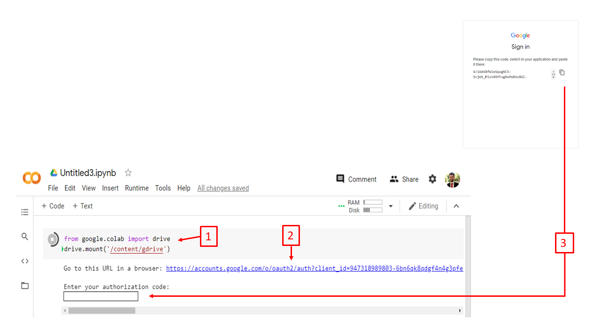
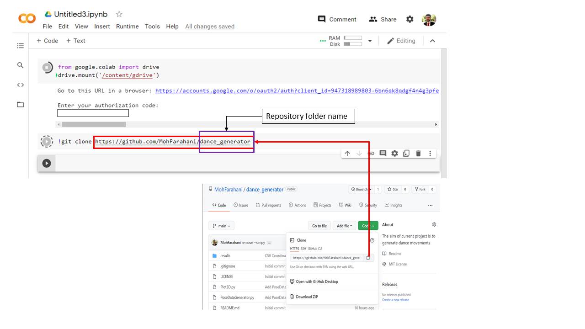
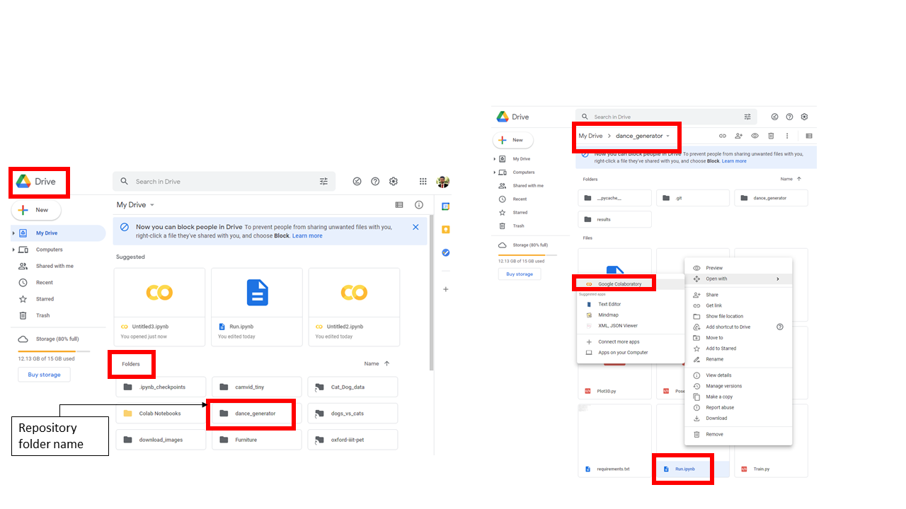
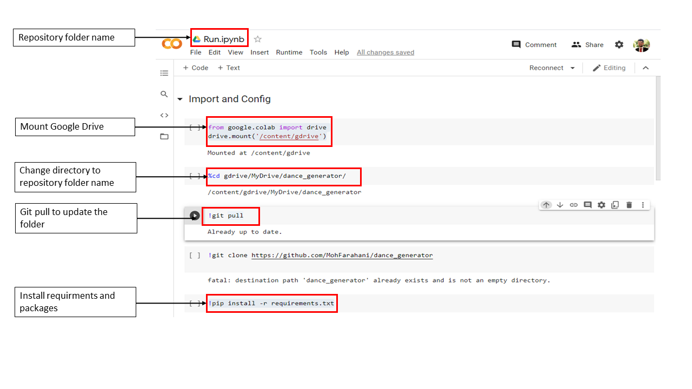

## How to run Github file on your Colab

1. Go to **colab** and from **File** open **New notebook**

2. Run the foolowing code int cell to mount your google drive:

`from google.colab import drive
    drive.mount('/content/gdrive')`

You need to click on the link to connect and **Sing in** and **Copy and Paste code**.

3. In next cell you have to clone the repository that you need.

4. Now you need to open your **Google Drive** and find the same folder name as the **repository folder name**. Then go inside it and open the file that you want in **colab**

5. At the first of your opened file, you can add the same code as first step to **mount your google drive**.  Then you need to **change your directory** to this folder. Now you can **git pull**. Then install the requirments and run the rest of program.

